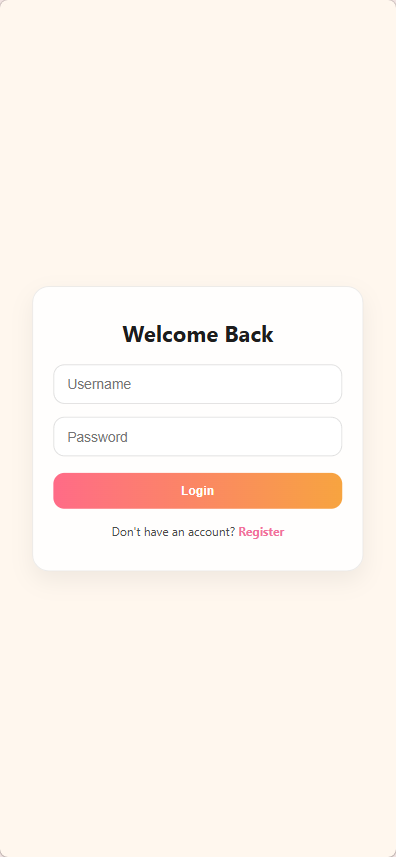
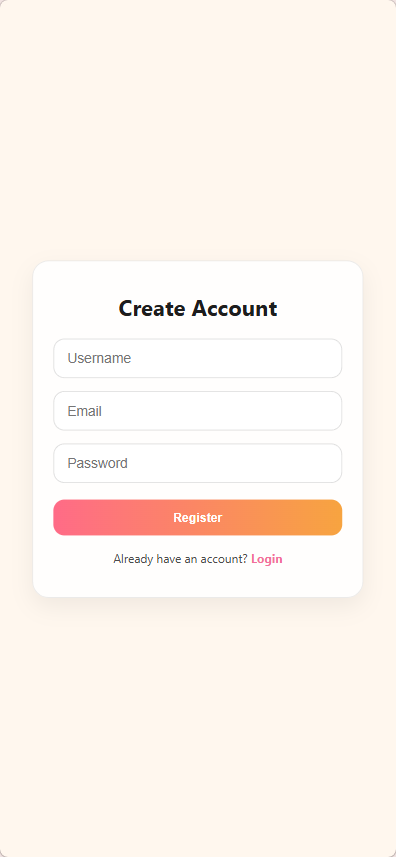
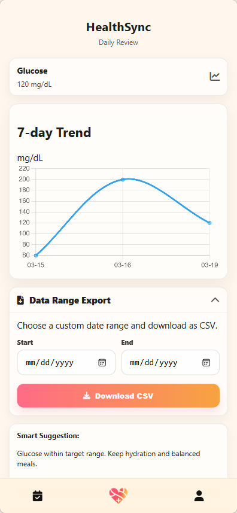
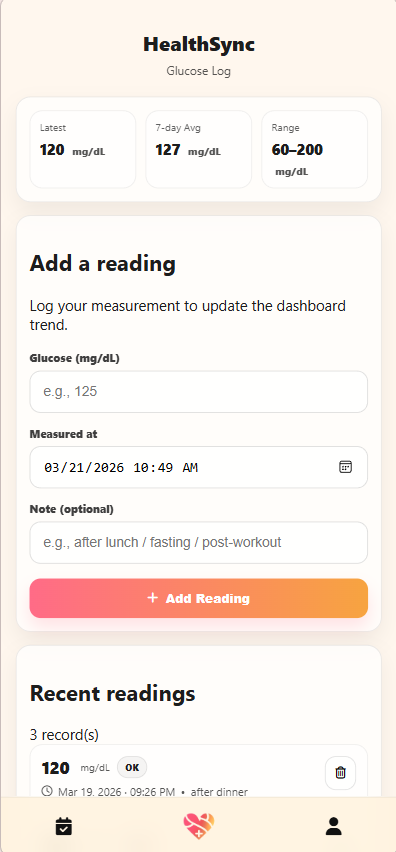
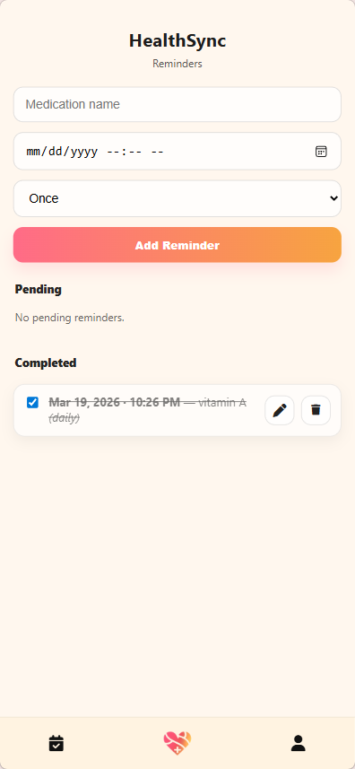
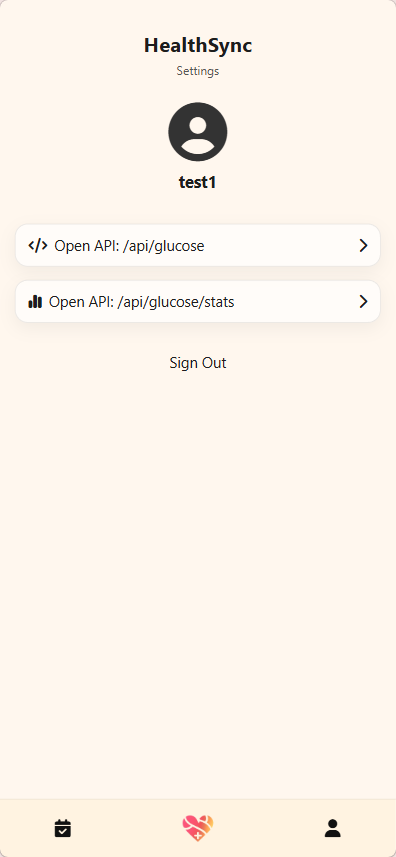

#  HealthSync – Glucose Tracking Web Application

A full-stack health tracking web application designed to help users monitor blood glucose levels, manage meals, and track daily health activities.  

🔗 **Live Demo**: https://healthsync-glucose-tracker.onrender.com  


##  Overview

HealthSync is a Flask-based web application that allows users to:

- Register and log in securely  
- Record and track blood glucose levels  
- Log meals and health-related notes  
- Set reminders for medication and activities  
- Export health data for personal tracking  

This project demonstrates full-stack backend development, database integration, and cloud deployment practices.


##  Tech Stack

### Backend
- Python
- Flask
- Gunicorn

### Database
- PostgreSQL (Production)
- SQLite (Development)

### Frontend
- HTML5
- CSS3
- JavaScript

### DevOps & Deployment
- Docker
- Render (Cloud deployment)
- Environment Variables (.env)


##  Features

- 🔐 User authentication (Register / Login / Logout)
- 📊 Glucose data logging
- 🍽 Meal tracking feature
- ⏰ Medication & reminder feature
- 📁 CSV-based data export
- 📈 Dashboard with health data overview
- ☁️ Cloud deployment with PostgreSQL integration


##  System Architecture
Client (Browser)
↓
Flask App (Gunicorn)
↓
PostgreSQL Database (Render)


##  Installation (Local Setup)

### 1. Clone the repository
```bash
git clone https://github.com/Joanwind/healthsync-glucose-tracker.git
cd healthsync-glucose-tracker
```

### 2. Create virtual environment
```bash
python -m venv venv
source venv/bin/activate   # Mac/Linux
venv\Scripts\activate      # Windows
```

### 3. Install dependencies
```bash
pip install -r requirements.txt
```

### 4. Set environment variables
Create a .env file:
```
DATABASE_URL=your_database_url
SECRET_KEY=your_secret_key
```

### 5. Run the app
```bash
flask run
```


##  Docker Deployment

### Build image
```bash
docker build -t healthsync .
```

### Run container
```bash
docker run -p 10000:10000 healthsync
```


##  Production Deployment
The application is deployed on Render with:

- Gunicorn as WSGI server
- PostgreSQL managed database
- Environment-based configuration
- Automatic build & deploy from GitHub


##  Engineering Highlights
- Migrated database from SQLite to PostgreSQL for production readiness
- Implemented environment-based configuration for secure deployment
- Containerised the application using Docker
- Integrated cloud database with Flask backend
- Configured Gunicorn for scalable production serving
- Debugged real-world deployment issues (port binding, DB authentication, environment variables)


##  Health Check Endpoint
```bash
GET /healthz
```
Returns:
```
{"status": "ok"}
```
Used for service monitoring and uptime validation.


##  Screenshots

### Login & Registration




### Dashboard



### Glucose Log



### Reminder System



### Settings




##  Future Improvements
- Add user session management (Flask-Login)
- Implement REST API structure
- Add data visualization charts
- Improve UI with frontend framework (React / Bootstrap)
- Add automated tests (pytest)


## Author
Joan


##  License
This project is released under the MIT License.
